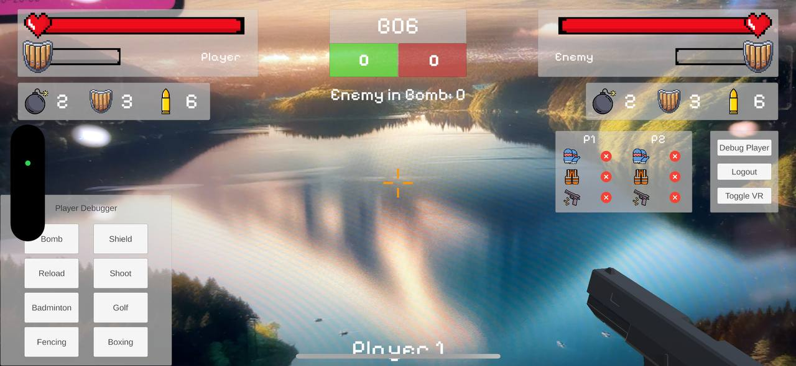
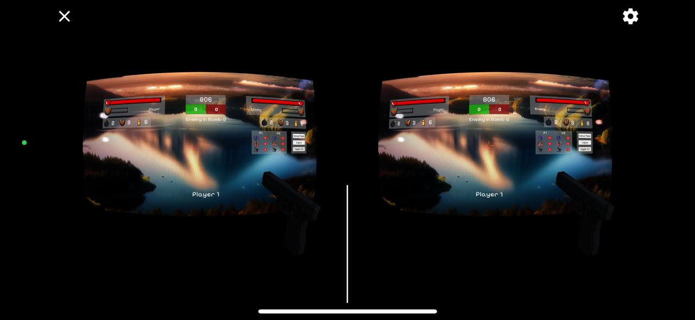

# Unity AR Laser Tag Game with Vuforia

Welcome to the **Unity AR Laser Tag Game Visualiser**!

This is the frontend of a 5-part group project for CG4002 Computer Engineering Capstone Project AY24/25 Semester 2! The other components include:
- Hardware
- Internal Communications
- External Communications
- AI on FPGA

This project features a two-player augmented reality (AR) laser tag game built using Unity and Vuforia. The game combines AR and VR elements to create an immersive experience. Players can battle each other using ranged projectiles and melee attacks, while managing their health, shields, and ammo. Real-time communication between players is achieved using **MQTT (Message Queuing Telemetry Transport)**.

---

## Features

- **Player Login System**: Players can log in and enter their unique usernames before starting the game.
- **AR View Mode**: Real-world environments are augmented with virtual objects, allowing players to locate each other and interact in AR.
- **VR View Mode**: Players can switch to VR mode for a fully immersive gaming experience.
- **Health and Shield System**: Players have health and shields. Shields absorb damage before health is affected.
- **Ammo Management**: Players must manage their ammo, which depletes with each attack. Ammo can be replenished at designated points.
- **Melee Attacks**: Close-range melee attacks have unique animations and effects.
- **MQTT Communication**: Real-time player data (e.g., health, ammo, position) is synchronized using MQTT topics.

---

## Screenshots

### Player Login Page


### AR View Mode


### VR View Mode


---

## Game Mechanics

### Health and Shield System
- Players start with a specific amount of **Health** and **Shield**.
- Once the shield is depleted, damage affects the player's **Health**.
- When health reaches zero, the player loses and the scoreboard is updated.

### Ammo System
- Players have a limited ammo count for their weapons.
- **Bullets** - total of 6 bullets and can be reloaded
- **Bombs** - total of 2 bombs each life (respawn to replenish)
- **Shields** - total of 3 shields each life (respawn to replenish)

### Projectile Effects
- Projectile Shots are implemented for **Badminton**, **Golf** and **Bomb** Actions
- Hits create an **impact effect** on the target, with audio feedback for successful shots.

### Melee Effects
- Players can perform close-range melee attacks for **Boxing** and **Fencing** Actions
- Melee attacks feature distinct **animations** and **impact visuals**, making them satisfying to use.

---

## MQTT Communication

The game leverages **MQTT** for real-time communication between players. Key features include:

- **Player State Synchronization**: Health, shield, ammo, and position updates are sent as MQTT messages.
- **Topics**:
  - `visualiser/req_visibility`: Subscribes to External Communications request for Visualizer's visibility
    ```json
    {
      "player_id": 1,
      "topic": "visualiser/req_visibility"
    }
    ```
  - `visualiser/visibility_feedback`: Publishes Player's visibility on the opposing player as well as the number of bombs the opposing player is standing on
    ```json
    {
      "player_id": 1,
      "is_visible": "false",
      "bombs_on_player": 2
    }
    ```
  - `visualiser/game_state`: Subscribes to External Communications' gamestate and update visual components / trigger game actions

    Example of shooting game action
    ```json
    {
      "player_id": 2,
      "action": "shoot",
      "hit": true,
      "game_state": {
        "p1": {
          "hp": 100,
          "bullets": 0,
          "bombs": 1,
          "shield_hp": 0,
          "deaths": 0,
          "shields": 2
        },
        "p2": {
          "hp": 55,
          "bullets": 6,
          "bombs": 2,
          "shield_hp": 0,
          "deaths": 0,
          "shields": 3
        }
      },
      "topic": "visualiser/game_state"
    }
    ```

---

## Getting Started

1. **Clone the Repository**:
   ```bash
   git clone https://github.com/yeo-menghan/unity-ar-laser-tag.git
   cd visualizer
   ```
2. Install Unity: Download and install Unity Hub and the required version of Unity.
3. Vuforia Setup:
    - Sign up for a free Vuforia Developer Account.
    - Obtain a Vuforia license key and add it to the Unity project.
4. MQTT Broker:
    - Set up an MQTT broker (e.g., Eclipse Mosquitto).
    - Configure the MQTT settings in the Unity project.
5. Build and Run:
    - Open the project in Unity, build the app, and deploy it to your AR-enabled devices.

## Technologies Used

- Unity: Core game engine.
- Vuforia: For AR tracking and augmentation.
- MQTT: For real-time communication.
- C#: For scripting and game logic.

## Project Progress

Project is still being developed and a demo video will be released soon (mid-April)
