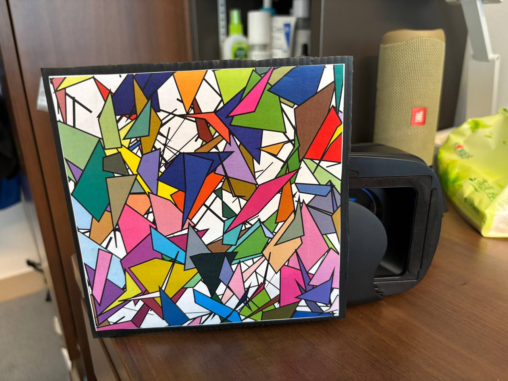
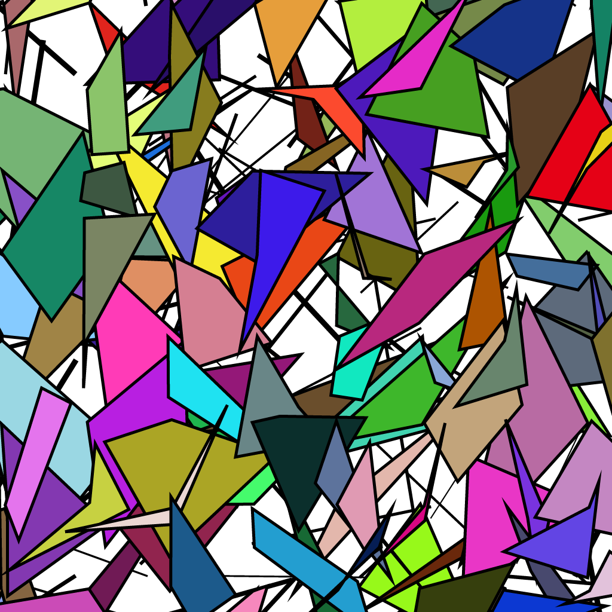
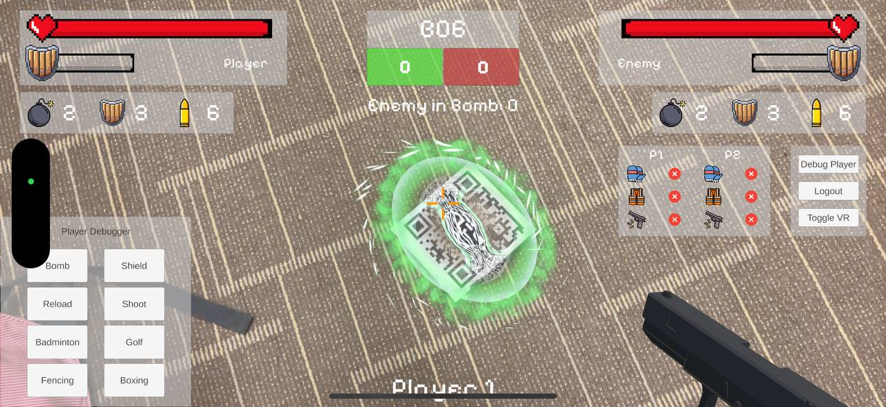

# Visualiser Developer Guide
This document outlines the game mechanics and architecture of the Unity AR Laser Tag Game Visualiser application.
The visualiser takes in information given by the External Comms component via MQTT and outputs the relevant game action effect and updates the game state (health, shield and ammo).
This developer guide serves to provide sufficient information for contributers.

## Hardware (VR Headset)

Each player will utilise a VR headest with their phones mounted and camera exposed (on the left side) as shown.

<p align="center">
  
</p>

## 🎮 Game Mechanics

### Vuforia Image Targets

Each player will be wearing a printed image target on their headset. Using Vuforia, when the player's camera is pointed at the image target, a visual effect will be displayed over it as shown. The exact real-world location of this image target can be retrieved too for other use cases such as spawning the snow bomb over the enemy. The image target overlay can also be toggled between different images.

<p align="center">
  
</p>

Phases
- Detection phase: Tested to be able to detect a **15cm x 15cm** image from **2 metres** away
- Tracking phase: Once detected, the player can continue to track the image overlay up till **3 metres** away in ideal lighting conditions

In this project, we've utilised the image below. This image was chosen due to its strong contrast and well-defined edges, which enhance recognition accuracy and ensure stable tracking across different lighting conditions and viewing distances. For best practices on which image to use, please refer to [vuforia's guide](https://developer.vuforia.com/library/vuforia-engine/images-and-objects/image-targets/best-practices/best-practices-designing-and-developing-image-based-targets/)

<p align="center">
  
</p>

### World Anchor

At the start of the game and after disconnection (when the player had to move a rather far distance away from the gameplay area), the QR code which represents the World Anchor is scanned by both players to ensure that the snow bombs drift are corrected.

This World Anchor is set at 1 metre above ground level and pasted vertically on a wall within the gameplay area. It is also used as a floor reference for the snow bomb to be spawned (bomb is offset -1 metre to appear on floor level).

This world anchor is implemented with Vuforia's Image Target. A green portal animation will overlay the QR Code to register the world anchor as shown.

<p align="center">
  
</p>

Note:
- Initially, the project has set up Vuforia’s World Center Mode to `SPECIFIC_TARGET` and set it to this World Anchor QR code. However, there's issues with the bomb drifting and having to scan the QR code very frequently. We've noticed that by setting to `DEVICE`, there's little to none bomb drift when the devices are within the gameplay area.
- Initially, the QR Code is pasted on the floor but the spawned snow bombs appear to tilt when the players scan the QR Code from an angle. This issue is resolved by pasting the QR Code on a vertical wall instead.

## 🗽 Architecture

### Project Hierarchy

This is the simplified project hierarchy:
```
ARCamera
 └── Player
      ├── HP Bar, ShieldHP Bar (Script)
      ├── Shield Animation (Script)
      ├── PlayerBombHandler (Script)
      ├── Game Action Prefabs with Controller Scripts (Shield, Gun, Boxing, Fencing, TakeDamage Vignette)
 └── PlayerGUI
      ├── Player & Enemy HP & Shield Bar
      ├── GameScores
      ├── Debugger
      ├── Device Connection Panel

EnemyImageTarget (Vuforia Image Target)
 └── Enemy Default Prefab
 └── Game Action Prefabs with Controller Scripts (Shield, Gun, Boxing, Fencing)

LoginScreen
 └── Player 1 / 2

ProjectileManager

EnemyProjectileManager

CardboardManager

CommsManager

GameState (Singleton Object)

WorldAnchor
 ```

### GameState

The GameState class is a Singleton Object that holds the state of UI, Device Connectivity, Player and Bomb elements.
- It is responsible for triggering Game Actions for the player via `HandleGameAction` and for the Enemy (from the Player's perspective) via `HandleEnemyGameAction`
- It is also responsible for handling requests for enemy's visibility

Attached are the variables that GameState holds:

```csharp
// Player Stats
private int playerId, playerCurrentHealth, playerCurrentShield, playerScore, playerShieldCount, playerBulletCount, playerBombCount;
private int playerInBombCount;
private bool playerVisibleToEnemy, playerHit, playerShieldHit;

// Enemy Stats
private int enemyCurrentHealth, enemyCurrentShield, enemyScore, enemyShieldCount, enemyBulletCount, enemyBombCount;
private int enemyInBombCount;
private bool enemyActive, enemyHit;
private Transform enemyCoordinateTransform;
private Dictionary<int, Vector3> activeEnemyBombs = new Dictionary<int, Vector3>();
private int nextEnemyBombId = 0;

// World Anchor
private Transform worldCoordinateTransform;

// Comms
private bool mqConnected;

// Events for property changes
public event Action EnemyActiveChanged;

// Device Connection
private bool p1_glove, p2_glove, p1_vest, p2_vest, p1_gun, p2_gun;

// Events for playing hit animations
public event Action PlayerHitEvent;
public event Action PlayerShieldHitEvent;
public event Action EnemyHitEvent;

public UnityActionEvent gameActionOccurred;
public UnityActionEvent enemyGameActionOccurred;
public event Action OnDeviceStatusChanged;
```

### MQTT Communication

The `MQTTCommsManager` script is responsible for the MQTT connection within the project:
- After player selection (in the login screen), MQTT connection will be established between the player and the broker automatically
- The Json messages will be forwarded to both players and the MQTTCommsManager will receive the relevant details accordingly to the correct player

NOTE: in the current implementation, there's a `KEEP_ALIVE_PERIOD_DEFAULT` under M2Mqtt / Messages / MqttMsgConnect.cs which has a default value of 60 seconds. If there's no messages sent from External Comms to the Visualiser within this period, the MQTT Connection may be terminated. Increasing this value to a higher value will solve this issue. For our project, we incremented this value to 600 seconds (10 minutes)

**Topics**:
- `visualiser/req_visibility`: Subscribes to External Communications request for Visualizer's visibility
  ```json
  {
    "player_id": 1,
    "topic": "visualiser/req_visibility"
  }
  ```
- `visualiser/visibility_feedback`: Publishes Player's visibility on the opposing player as well as the number of bombs the opposing player is standing on
  ```json
  {
    "player_id": 1,
    "is_visible": "true",
    "bombs_on_player": 2
  }
  ```
- `visualiser/game_state`: Subscribes to External Communications' gamestate and update visual components / trigger game actions

  Example of "gun" action
  ```json
  {
    "player_id": 1,
    "action": "gun",
    "hit": true,
    "game_state": {
      "p1": {
        "hp": 100,
        "bullets": 6,
        "bombs": 2,
        "shield_hp": 0,
        "deaths": 0,
        "shields": 3
      },
      "p2": {
        "hp": 100,
        "bullets": 6,
        "bombs": 2,
        "shield_hp": 0,
        "deaths": 0,
        "shields": 3
      }
    },
    "topic": "visualiser/game_state"
  }
  ```

- `visualiser/device_status`: Subscribes to External Communications' device connection info on glove, vest and gun (received from Internal Comms)

  Example json
  ```json
  {
    "player_1": {
      "gun_connected": true,
      "vest_connected": true,
      "glove_connected": true
    },
    "player_2": {
      "gun_connected": true,
      "vest_connected": true,
      "glove_connected": true
    }
  }
  ```

### ProjectileManager / EnemyProjectileManager
The `ProjectileManager` class orchestrates the firing and handling of all projectiles in the game, including golf balls, badminton birdies, and bombs. It listens for game action events and triggers the appropriate projectile responses, integrating with supporting systems such as the projectile launcher, bomb handler, and action wait UI.

Responsibilities:
- Event Listener: Subscribes to GameState.gameActionOccurred to respond when a projectile action occurs.
- Projectile Handling: Fires different types of projectiles based on the action type received (golf, badminton, or bomb).
- Bomb Effects: When firing a bomb, spawns a bomb effect on the enemy after a delay if an enemy is active.
- UI Feedback: Notifies the ActionWaitBar to visually indicate waiting periods after firing any projectile.

Example Flow:
1. The player triggers an action (e.g., "golf" or "bomb").
2. ProjectileManager.HandleProjectile() is called with the action type.
3. The relevant projectile is fired using projectileLauncher.FireProjectile().
4. For bombs, after a short delay, the bombHandler spawns the bomb effect on the enemy.
5. The actionWaitBar starts its cooldown animation after any projectile action.

### CardboardManager
The `CardboardManager` class manages launching and exiting Google Cardboard XR mode in a Unity application. It handles initializing the Cardboard XR loader, transitioning UI canvases between VR and standard modes, and providing hooks for debugging overlays.

Responsibilities:
- Google Cardboard Integration: Handles runtime initialization and shutdown of the Cardboard XR experience.
- UI Transitioning: Switches specified UI canvases between ScreenSpaceOverlay (standard) and WorldSpace (VR) modes.
- Debug Overlay Handling: Controls visibility and interactivity of debug UI using a CanvasGroup and an optional DebuggerToggle.

## Action Moves
All action moves are coded in C#, allowing greater customisability for those who do not know how to animate in Unity.

Each move has their audio files too.

<div align="left">

<table>
  <thead>
    <tr>
      <th>Action Move</th>
      <th>Preview</th>
    </tr>
  </thead>
  <tbody>
    <tr>
      <td>Shield</td>
      <td></td>
    </tr>
    <tr>
      <td>Gun</td>
      <td></td>
    </tr>
    <tr>
      <td>Bomb</td>
      <td></td>
    </tr>
    <tr>
      <td>Golf</td>
      <td></td>
    </tr>
    <tr>
      <td>Badminton</td>
      <td></td>
    </tr>
    <tr>
      <td>Fencing</td>
      <td></td>
    </tr>
    <tr>
      <td>Boxing</td>
      <td></td>
    </tr>
    <tr>
      <td>Reload</td>
      <td></td>
    </tr>
    <tr>
      <td>Logout</td>
      <td></td>
    </tr>
  </tbody>
</table>

</div>

## Future Improvements

### Bomb Spawn on Self

- Initially, we've also included a feature to spawn the bomb in the player's world space where the enemy spawn a snow bomb on the player. However, we've had issues syncing the position of the bomb between the 2 player's separate world spaces. A potential solution will be synchronising a world space via MQTT, however it may introduce additional latency (which is a graded component for this project).
